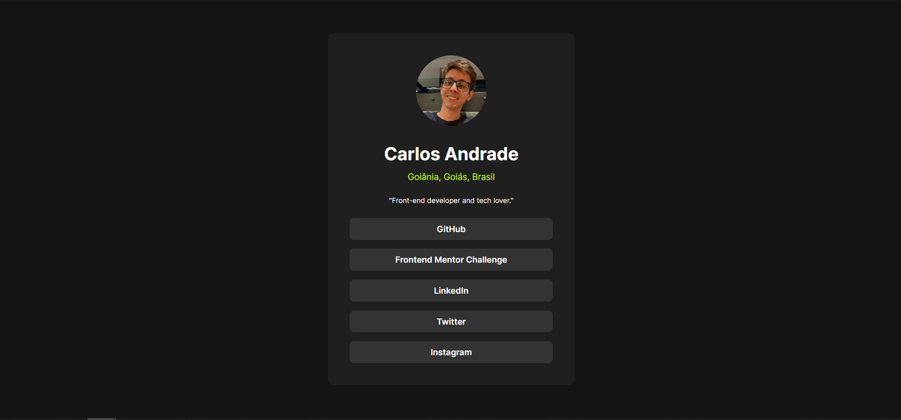
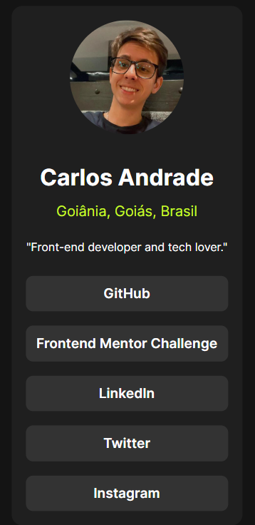

# Front end Mentor Challenge - Social links profile

Based on challenge in <a href="https://www.frontendmentor.io/challenges/social-links-profile-UG32l9m6dQ">Here</a>

## Finished project

## Mobile View

## What i'm learning

<ul>
<li>
    HTML Structure
</li>
<li>
    CSS Styling
</li>
<li>
    Mobile Reponsive
</li>
</ul>

## Do you want to see?
<a href="https://65cbd17996ba3b13fc186154--thriving-bunny-b76680.netlify.app/">Open Here :dart:</a>